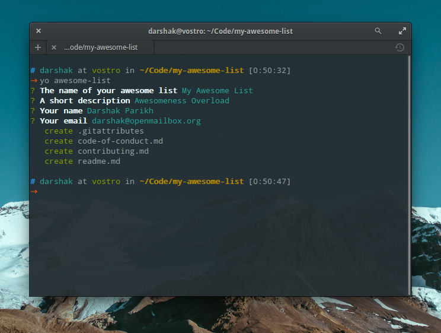

# generator-awesome-list

> Yeoman generator for GitHub [awesome lists](https://github.com/sindresorhus/awesome) :sunglasses:

[](https://travis-ci.org/dar5hak/generator-awesome-list)
[](https://www.npmjs.com/package/generator-awesome-list)
[](https://www.apache.org/licenses/LICENSE-2.0)

## Usage

```sh
npm install -g yo generator-awesome-list
yo awesome-list
```

### Using Docker

#### Build the Docker image

```sh
docker build . -t generator-awesome-list
```

#### Create and run the container based on above image

The following does the same as the non-container command `yo awesome-list`.

```sh
docker run --rm -it -v ${PWD}:/app  generator-awesome-list
```

## What's included?

This stuff is heavily stolen from [Sindre Sorhus](https://github.com/sindresorhus)'s lists.

- `readme.md` skeleton
- `contributing.md` skeleton
- `code-of-conduct.md` based on [Contributor Covenant](http://contributor-covenant.org)
- a simple `.gitattributes` to make contributing easier


